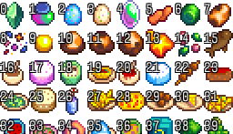

# Stardew Sprite Image Indexer

Python script to add index numbers to Image spritesheets, starting with 0 in the top left corner.
Resulting files are doubled in size for legibility.

Made by request for a Mac user who wanted similar functionality to the Windows only script by Calcifer.

## Requirements

* Python 3
* Pillow

## Usage

Put any images you wish to add in to the "in" directory.

Inbound files should use the name convention "yourfilename-w-h.ext" where w and h are the width and height of a cell.

For example:
* If you want to index "springobjects.png", place it in the "in" directory with the name "springobjects-16-16.png".
* If you want to index an NPC spritesheet such as "Characters/Abigail.png", use the name "Abigail-16-32.png"

**Run the script with `python convert.py`**

Images will be taken from the "in" folder, moved to the "processed" folder afterwards. The enlarged image with numbers will be placed in the "out" folder, with the name "yourfilename-indexed".
